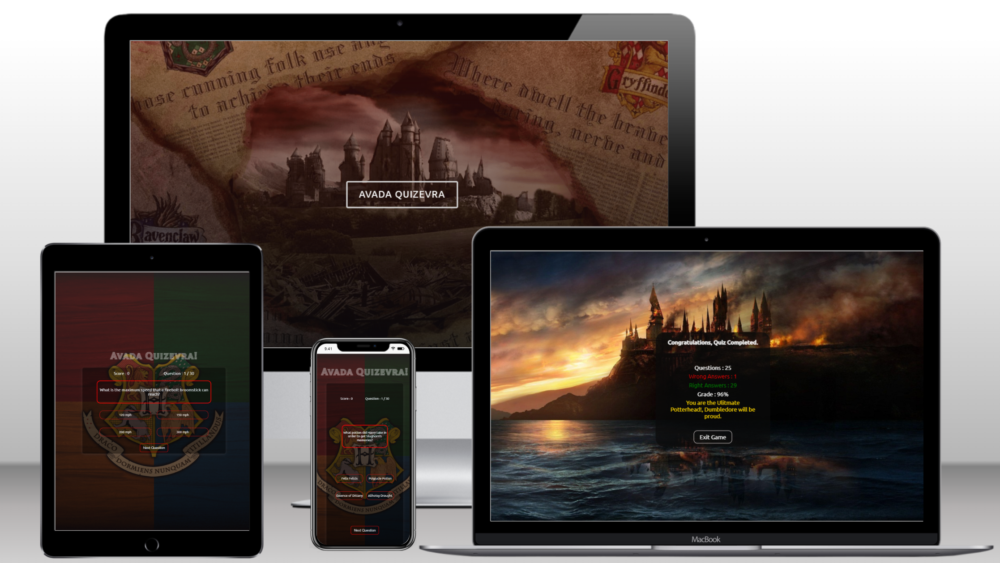

# Avada Quizevra : Quiz Game Application

# Introduction

Avada Quizevra is a web based application designed using HTML5, CSS and Java Script. Avada Quizevra is the ultimate fun quiz that has been specifically designed for the ultimate Harry Potter fan also known as "Potterheads". The quiz consists of 30 hard questions that are based from the books and films. This quiz will test their knowledge and push their limits on how much that they really know about Harry Potter.

[View the live project here.](https://avada-quizevra.netlify.app/)

My approach for designing this Quiz game application was to create it so that it is not only accessible to view on desktop but it is also mobile responsive. The application is also accessible through a range of different devices.

## Features

- There is an game rule pop up box explaining how to play the quiz.
- There are 30 questions to answer, questions range from medium to hard.
- The player must select an answer, so no skipping questions.
- If a player skips a question a warning box will pop up.
- If the player chooses the correct answer the box will turn green and if the answer is incorrect the box will turn red.
- The player will get one point for each correct question.
- Once the player completes the quiz, a results box will pop up.
- Player can choose to play again or choose to exit the game.

## Usage

- Visit https://avada-quizevra.netlify.app/
- Read the game rules for the quiz and the click play when you are ready.
- Each question will provide you with four possible answers, player will need to choose one in order to move to the next question.
- Answer all 30 questions to complete the quiz.

# Frameworks & Programs Used

- Google Fonts One: [Tilt Prism](https://fonts.google.com/?query=Tilt+Prism)

- Google Fonts Two: [Ubuntu](https://fonts.google.com/specimen/Ubuntu?query=Ubuntu)

- [Fontawesome](https://fontawesome.com/)

# Credit

- **Imagery**
  - All the imagery that are being used for this game application are taken from a desktop wallpaper website called Wallpaper Cave.
    [View ](https://wallpapercave.com/harry-potter-hd-wallpapers)
- **Content**
  - All the content for the Instruction box for the quiz game was written by me.
  - All the content for the quiz questions and answers were taken from various quiz game websites that I have found on Google.
  - [View Wizzarding World ](https://www.wizardingworld.com/quiz)
  - [View Kidadl (book questions) ](https://kidadl.com/articles/harry-potter-book-trivia-questions-and-answers-for-every-muggle)
  - [View Kidadl (hard questions) ](https://kidadl.com/articles/hard-harry-potter-trivia-questions-and-answers-are-you-a-true-potterhead)
  - [Insider (hard questions) ](https://www.insider.com/harry-potter-trivia-2016-11)
  - [The big quiz thing ](https://bigquizthing.com/trivia-questions-ans/harry-potter-trivia-questions-and-answers/)
