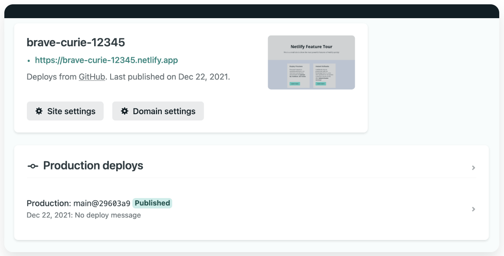
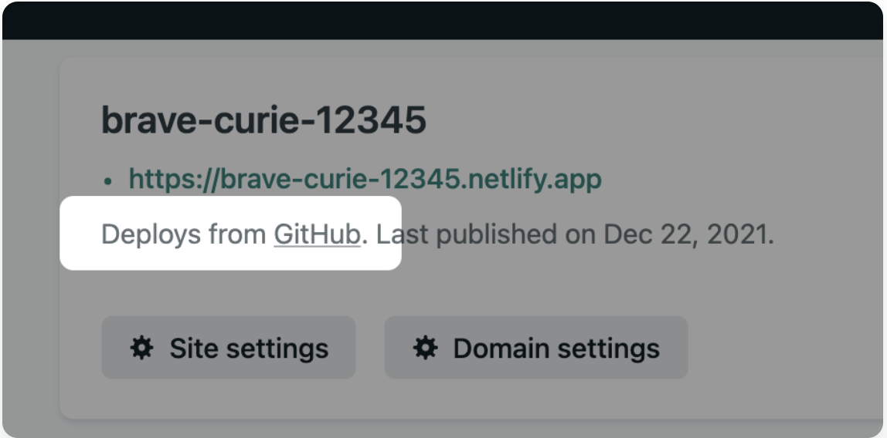
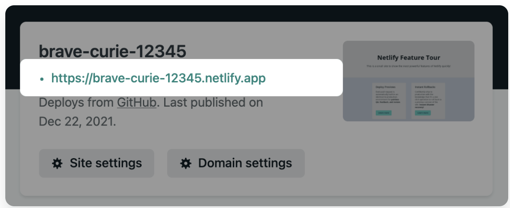

# Avada Quizevra : Quiz Game Application

# Introduction

Avada Quizevra is a web based application designed and bulit using HTML5, CSS and Java Script. Avada Quizevra is the ultimate fun quiz that has been specifically designed for the ultimate Harry Potter fan also known as "Potterheads". The quiz consists of 30 hard questions that are based from the books and films. This quiz will test their knowledge and push their limits on how much that they really know about Harry Potter.

[View the live project here.](https://avada-quizevra.netlify.app/)

My approach for designing this Quiz game application was to create it so that it is not only accessible to view on desktop but it is also mobile responsive. The application is also accessible through a range of different devices.

## Features

- There is an game rule pop up box explaining how to play the quiz.
- There are 30 questions to answer, questions range from medium to hard.
- The player must select an answer, so no skipping questions.
- If a player skips a question a warning box will pop up.
- If the player chooses the correct answer the box will turn green and if the answer is incorrect the box will turn red.
- The player will get one point for each correct question.
- Once the player completes the quiz, a results box will pop up.
- Player can choose to play again or choose to exit the game.

## Usage

- Visit https://avada-quizevra.netlify.app/
- Read the game rules for the quiz and the click play when you are ready.
- Each question will provide you with four possible answers, player will need to choose one in order to move to the next question.
- Answer all 30 questions to complete the quiz.

# Programs Used

- Google Fonts One: [Tilt Prism](https://fonts.google.com/?query=Tilt+Prism)

- Google Fonts Two: [Ubuntu](https://fonts.google.com/specimen/Ubuntu?query=Ubuntu)

- [Fontawesome](https://fontawesome.com/)

# Running Locally

## Live server

1.You will need node.js and npm. You should probably install this globally.

2.run the following command in your terminal:

npm install -g live-server

3.In your project directory issue the command live-server

4.This will automatically launch the default browser. When you make a change to any file, the browser will reload the page - unless it was a CSS file in which case the changes are applied without a reload.

# Deployment

## Deploy a project to Netlify

This site was deployed to Netlify. Plese follow these steps to deploy your site:

One way to get started deploying on Netlify is to use a Deploy to Netlify button to add a site.

1.Select the Deploy to Netlify button.

You will get directed to the Netlify app to create a new site. You should find the following page, asking you to connect to GitHub.

2.Select Connect to GitHub to authenticate. If you don’t already have a Netlify user account, you will get one as part of this process.

3.Select Save & Deploy. As well as creating a new site on Netlify, this process clones the demo project repository to your GitHub account so you can make your own changes later on.

You will be redirected to the Site overview page where you can check for the deploy in the Production deploys list.

You can also check that the repository has been cloned properly by selecting GitHub to navigate to your new repository on GitHub.

4.Once the deploy has finished building, you should get a production URL where you can access the website.

5.You can choose to customize the URL by changing the site’s name in the Netlify UI at Site settings > Site details > Site information.

# Credit

- **Imagery**
  - All the imagery that are being used for this game application are taken from a desktop wallpaper website called Wallpaper Cave.
    [View ](https://wallpapercave.com/harry-potter-hd-wallpapers)
  - [Iconfinder (Harry Potter Favicon)](https://www.iconfinder.com/search?q=harry+potter)
- **Content**

  - All the content for the Instruction box for the quiz game was written by me.
  - All the content for the quiz questions and answers were taken from various quiz game websites that I have found on Google.
  - [View Wizzarding World ](https://www.wizardingworld.com/quiz)
  - [View Kidadl (book questions) ](https://kidadl.com/articles/harry-potter-book-trivia-questions-and-answers-for-every-muggle)
  - [View Kidadl (hard questions) ](https://kidadl.com/articles/hard-harry-potter-trivia-questions-and-answers-are-you-a-true-potterhead)
  - [Insider (hard questions) ](https://www.insider.com/harry-potter-trivia-2016-11)
  - [The big quiz thing ](https://bigquizthing.com/trivia-questions-ans/harry-potter-trivia-questions-and-answers/)

  * **Other Resources**
  * I have crossed referenced all the questions and answers for my quiz on Harry Potter Fan page website. I need to make sure that all the answers to the questions are correct and not misleading or totally wrong.
    [View ](https://harrypotter.fandom.com/wiki/Main_Page)
